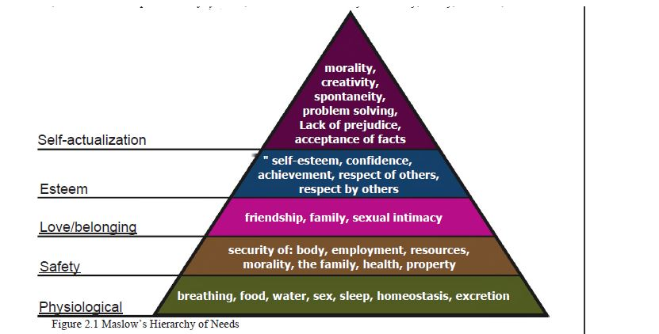
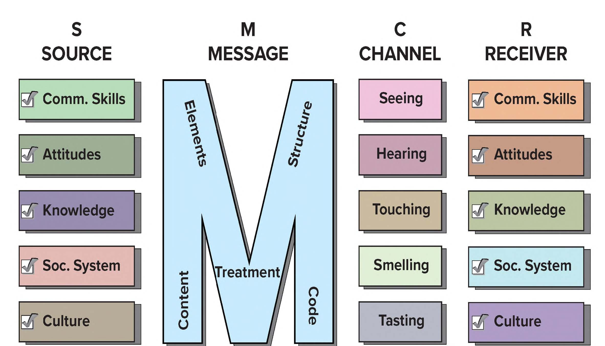
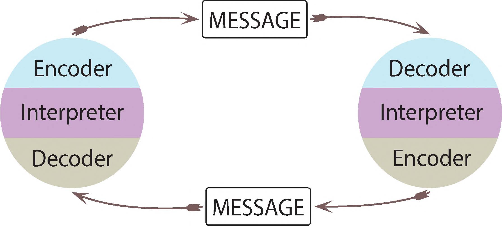
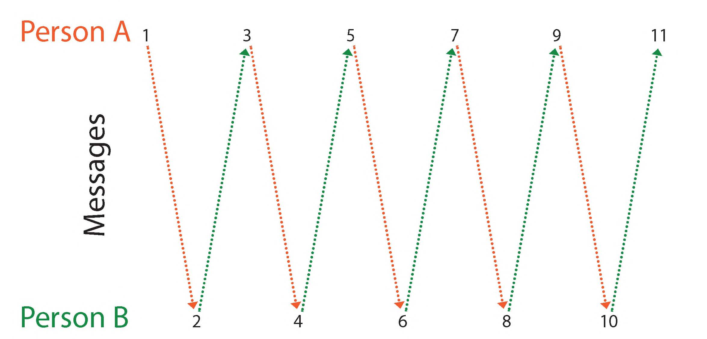

# Chapter 2
Things that need to be done for Chapter 2
- [x] Read Chapter 2
- [x] Take Chapter 2 Quiz
- [x] Watch Video
- [x] Reply to Discussion
- [ ] Do Application

*****
## Learning Objectives
- Explain Maslow's hiearchy of needs and its realtionship to communicaiton
- Differentiate between itnerpersonal and communciation models
- Describe the skills associated with effective interpersonal communication
- Identify an interpersonal communicaiton (IPC) skill that you would like to improve

### Overview

This week you will learn about interpersonal communication skills, and how to develop them. You will also learn about the models of interpersonal communication, and apply them to your own lives to gain a more complicated and accurate understanding of your communication practices.

*****

## ***Important Terms and Definitions***

**Maslow's Heirarchy of Needs**
- Physiological Needs (breathing, food, water, sex, sleep, homeostasis, excretion)
- Safety (security of: body, employment, resources, morality, the family, health, property)
- Love/belonging (friendship, family, sexual intimacy)
- Esteem (Self-eseteem, confidence, achievement, respect of otehrs, respect by others)
- Self-Actualization (morality, creativity, spontaneity, problem solving, Lack of prejudice, acceptance of facts)

**Uncertainty Reduction Theory**: Theory addresses cognitive uncertainty[^1], and behavioral uncertainty[^2]. Three strategies are used to reduce uncertainty: passive, active and interactive.
**Passive**: Accomplished through observation, avoid disrupting the other individual
**Active**: Involve asking a friend for informaiton or observing social netowkring.
**Interactive**: Involve direct contact with the other individual.

*Self-Disclousure* is important to reduce the uncertainty, must be reciprocated to reduce uncertainty. 
With this we tend to consider 3 things:
   1. Persons ability to punish or reward us.
   2. The degree to which they meet or violate our social expectations.
   3. Whether we expect to reencounter them.

2.2

**Sender**: The source of the message, person who decides to communicate and the intent of the message. Can withold or release info.

**Receiver**: Individual who decodes the message and tries to udnerstand the source (read sender) of the message. If receiver did not get the message communiaiton did **NOT** happen.

**Message**: Any type of textual, verbal, nonverbal aspects of communication in which individuals give meaning.

**Channel**: Where the message is sent/received, SMS, Facebook, Twitter, email, Insta, Snap, Reddit, etc..., Face-Face, Letters, Phonecalls, TV, etc...

**FeedbacK**: Response to the message

**Environment**: Context, situation where communication occurs and affects the experience. Can also be related to past experience/background.

**Noise**: Anything that interferes with the message is called noise. There are 4 types:
- 1. Physical noise
- 2. Psychological Noise: Frustration, anger, happiness, depression. Hard to see/deal with
- 3. Semantic Noise: Jargon, accents, language use - poor word choice can cause problems
- 4. Physiological Noise: The receivers body interferes with the reception of the message, blind or deaf person not being able to see or hear the message. Hunger/tiredness might cause someone to not pay attention.

2.3 Perception Process

**Perception**: The process of acquiring, inerpreting, organizing information that comes in through your five senses.

1. **Attending**: Frist step of the percetption process is to select what informatin you want to pay atention to or focus on. 
2. **Organizing**: Making what we payed attention to make sense. Four organization schemes.
     1. Physical constructs: Used to classify people
     2. Role constructs: social posistions - eg. mom, friend, doctor
     3. Interaction Contructs: The Social behaviors displayed in the interaction. 
     4. Psychological Constructs: Dispositions, emotions, and internal states of mind of the communicators.  
3. **Interpreting**: Attaching meaning to understand the data. This can be impacted by your:
     1. Personal experience, 
     2. Involvement. 
     3. Expectations.
     4. Assumptions
     5. Relational Satisfaction

2.4: Models of Interpersonal Communication

**Model**:Simplified representaiton of a system (often graphic) that highlights crucial componenets and connections of concepts, which help people understand an aspect of the real world

**Action Models**: View communication as one directional transmission of iformation from a source/sender to some destination/receiver.
-  1. **Shannon-Weaver Model**: aka Linear Communication Model - communication is liear in fashioin, feedback is not immediate. Newspapers, radio and tv good examples.
- 2. **Early Schramm Model**: regards communication as a process between an encoder and a decoder, this model accounts for how people interpret the message. Any coomunication where feedback/decoding does not occur is not effective or complete
- 3. **Berlo's SMCR Model** S- Sender, M - Message, C - Channel, R - Receiver.

**Interaction Models**: View the sender and receiver for the effectiveness of the communication.
1. **Osgood and Schramm Model**: Circular model, messages can go in two directions. Encoding/decoding can be a continuous cycle. 
    1. Communication is circular 
    2. Communication is reciprocal and equal 
    3. messages are based on interpretation 
    4. Communication involves encoding, decoding and interpreting.

2. **Watzlawick, Beavin, and Jackson Model**: Argue that communication is continuous, 5 axioms.
    1. Communicaiton cannot, not happen
    2. Every message has a content and relationship dimension.
    3. How the communicators in the system punctuate their communicative sequence
    4. Communication can be analog or digital.
    5. Communication can be symmetrical or complementary: ergo both communicators have similar power relations or they don't.

**Transaction Models**: Demonstrate that the individuals are often acting as both sender and receiver simultaneously. 
* **Barnlund's Transactional Model**: Argues that during interpersonal interactions, we are both sending and receiving messages simultaneously. We provide oral, nonverbal feedback and they are both equally important to the sender in communicating their message was received. 
    * **The Importance of Cues**: Public - anything physical or environmental. Private - private objecs of the orientation, including senses of a person. Behavioral clues - Nonverbal/verbal cues.
    * **The Importance of Context**: 
        1. Social context: rules and norms that govern how people communicate with one another
        2. Cultural context: Cultural and co-cultural identities tha tpeople have (age, ability, biological sex, gender identity, ethnicity, nationality, race, sexual orientation)
        3. Relational context: The nature of the bond or emotional attachment between two people.
    * **The Importance of Noise**: Includes things that disturb/interrupt the flow of communication
        1. Physical Context: Where the interaction occurs, physical space.
        2. Physiological Context: Bodys response to environment
            * Internal: Internal processes e.g. hunger, headache, alertness
            * External: Result due to external stimuli, e.g. you are hot, color of room, comfort
        3. Psychological Context: How the mind reacts/responds to what is in the environment
        4. Semantic Context: Understanding/interpretaion of he different meessges sent.

**Transaction Principles**:
1. Communication is Complex
2. Communication is Continuous
3. Communication is Dynamic

2.5 Interpersonal Communication Skills

* **Listening Skills**: most important part of communication. Should be 'mindful' listening, giving attention and thought to the message communicated to you. 
* **People Skills**: Set of characteristics that help you interact well with others.
* **Emotional Intelligence**: Ability to recognize your own emotions and the emotions of others.
* **Appropriate Skill Selection**: Use context to act accordingly and use different skills such as humor, seriousness anything else like it. 
* **Comunicating Ethically**: Being honest. Credo of National Communication Associastion:
    1. We advocate truthfulness, accuracy, honesty, and reason as essential to the integrity of communication.
    2. We endorse freedom of expression, diversity of perspective and tolernace of dissent to achievee the informed and responsible decision making fundamental to a civil society.
    3. We strive to understand and respect other communicators before evaluating and responding to their messages
    4. We promote access to communication resources and oppportunities as necessary to fulfill human potential and contribute to the well-being of individuals, families, communities, and society. 
    5. We promote communication climates of caring and mutual understanding that respect the unique needs and characteristics of individuals. 
    6. We condemn communication that degrades individuals and humanity through distortion, intimidation, coercion and violence, through the expression of intolerance and hatred.
    7. We are committed to the courageous expression of personal convictions in pursuit of fairness and justice. 
    8. We advocate sharing informaiton, opions, and feelings when facing significant choices while also respecting privacy and confidentiality. 
    9. We accept responsibility for the short- and long-term consequences of our own communication and expect the same of others. 

*****
## **Things I liked**

*****
Footnotes:

[^1]: Cognitive Uncertainty: Uncertainty associated witht he beliefs and attitudes of another.\
[^2]: Behavioral Uncertainty: Uncertainty regarding how another person must behave