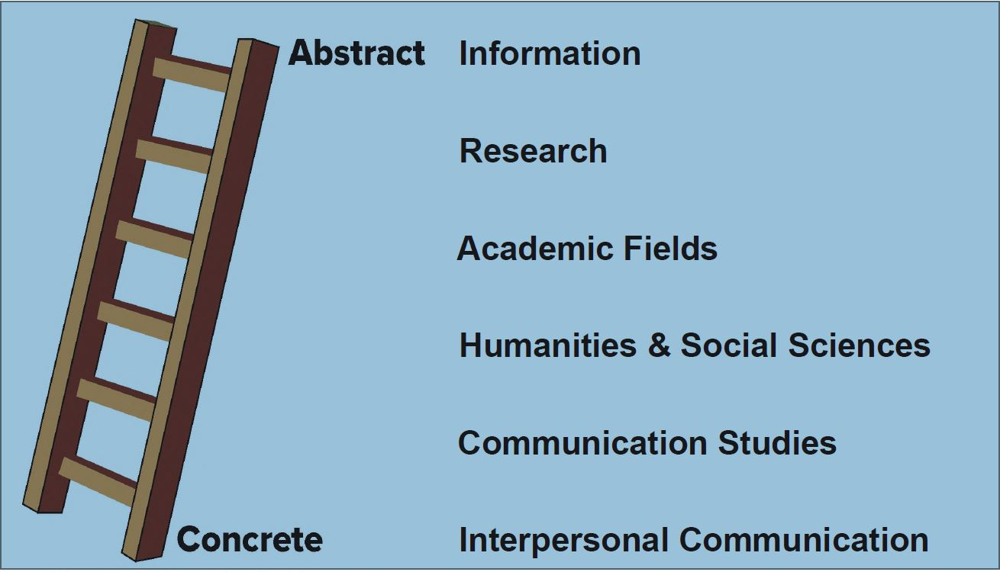
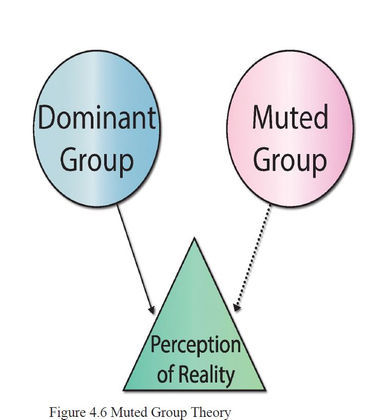

# Chapter 4 Reading Notes
Module 4 notes and Chapter 4 reading notes.
Tasks for Module 4
- [ ] Read Chapter 4
- [ ] Watch and Discuss
- [ ] Application Activity #3
- [ ] Research Activity #1

## Learning Objectives: 
- Describe the nature of words nad language
- Identify the interactional and imaginative functions of language
- Explain the dark side of language
- Apply IPC principals to improve vocabulary

## Overivew
Thsi week, you will learn the complex ways language shapes our lrelationships and world views. You will explore the roots of words in an effort to u ndertand how language and meaning shift, change and evolve over time and history. You will also learn how to use the UVU library database. 

## Chapter 4 Verbal Elements of Communication
**Language**: A system of human communication using a particular form of spoken or written words or other symbols, consists of the use of words in a structured way.
### 4.1 How Words Work
Three Rules:
1. **Semantic Rules**: Dictionary definition of the word. Meaning can change based on the context in which it is used. 
2. **Syntactic Rules**: Govern how we help guide the words we use. Refer to th euse of grammer, structure, and punctuation to help effectively convey our ideas. 
3. **Pragmatic Rules**: Help us interpret messages by analyzing the interaction completely. We need to consider the words used, how they are stated, our relationship with the speaker, and the objecives of our communicaiton. 
Words can shape our reality. What is said and/or unsaid can change how we view reality. 

Words reflect attitudes we have. We will use words that reflect what we feel about a person/situation based on our own personal experiences with that person/situation/event. 

Language can be abstract, shorten sentences that are not descriptive and leave things vague. 

**Abstraction Ladder**[^1]: S.I. Hayakawa came up with it in 1941. At the top is abstraction and the bottom is concrete and non-vague things. 

**Metamessages**: Relationship messages that are sent among people who they communicate. Can be verbal, nonverbal, direct or indirect.

**Denotative Meaning**: Dictionary definition of a word.

**Connotative Meaning**: Subjective definition of a word. 

## 4.2 Functions of Language

**Instrumental Functions**: Use language to fulfill a need.

**Regulatory Functions**: To influence the behaviors of others through requests, rules or persuasion. 

**Interactional functions**: Help maintain or develop the relationship, also help alleviate the interaction.

**Imaginative Functions**: Help create imaginary constructs and tell stories. 

**Personal Functions**: The use of language to help you form your identity or sense of self.

**Heuristic[^2] Function**: Use to learn, discover and explore.

**Representational Function**: Used to request or relay information. Straightforward statements no explanation neeeded ```Example: My Cat is asleep```

**Ritual Function**: Involve words we routinely say to others ```Examples: Goodbye, Hellow```

## The Impact of Language

**Affiliation**: When we want people to affiliate with us, we may start to use vocabulary they are more comfortable/familiar with. 

When our language converges or diverges it can have an impact in the way we are perceived by others. 

**Bias**: An attitude htat is not objective or balanced. It is prejudiced, or the use of words that intentionally or unintentionally offend people or express an unfair attitude concerning a persons race, ethnicity, sexual orientation, age, disability, or illness. 

**Sexism**: Bias against others based on their sex. Sexist language is then words, phrases, and expresions that unnecessarily differentiate between females and males or exclude, trivialize, or dimish either sex.

**Racism**: Bias towards others of a different race. Racist language conveys that a racial group is superior or better than another. 

**Muted Group Theory[^3]**: Was initially developed to explain the way humans, specifically men and women, communicate. It argues that dominant members of society, create a language and a system of communicaiton that subverts or reduces other groups, specifically women. The Image below is often seen as the dominant groups view is "reality" whereas the muted groups view is fanciful or less than "real" as the dominant groups view. (Yuck, I need to do better at making sure I don't do the same, find better words to use). 

## 4.4 Types of Language

**Formal Language**: Official and academic Language. Uses full sentences and is grammatically correct, is more objective and therefore more complex. 

**Informal Language**: Common everyday language which includes slang. Simplified, and have more contractions/abbreviations. 

**Jargon**: Specialized and/or technical knowledge of a specific group/profession that may not be understood by outsiders. 

**Colloquialisms**: User of informal words in communication. Vary from region to region. Some examples: ```Bamboozle, Buzz off, fell through the cracks```

**Slang**: Words that employed by certain groups, such as young adults/teens. Slang is more commonly spoken rather than written.

**Idioms[^4]**: Expressions of figures of speech whose meaning cannot be understood by looking at teh individual words and interpreting them literally. 

**Cliche**: An idea of expression that has been so overused that it has lost its original meaning. Very common phrases. 

**Improper Language**: Language that is often vulgar and involves cursing. Includes language that is offensive or lacks good taste, vulgar is often lewd/obscene. Cursing is language that includes evil, doom, misfortune on a person or group. Can include curse/profane words.

**Biased Language**: Language that shows preference in favor of or against a certain point-of-view, shows prejudice, or is demeaning of others.

**Ambiguous Language**: Language that can have various menaings. 

**Euphemisms**: Make language unclear, people use them to say something more politely or less bluntly. Makes things sound better than they are. 

**Relative Language**: Depends on the person communcating. In other words language is based on our perception of our experiences. 

**Static Evaluation**: States that things are not constant. 

## 4.5 Improving Verbal Communication

**Tips and tricks to improve your Verbal Communication:**
1. Use Repetition
2. Group similar words together
3. Build *YOUR* vocabulary
    1. Keep a jounal of words you don't know
    2. If you don't know a word, look it up!
    3. Learn to recognize Latin and greek roots
    4. Play vocabulary games (Your parents will most likely win for awhile)
    5. Make synonym and antonym word lists
    6. Takw a writing/editing course (I would suggest editing, you learn almost more from proofreading others work)
4. READ! (I need to get back to reading more)
**Vocabulary**: All the words understood by a person or group of people.

**Language Awareness**: A persons ability to be mindful and sensitive to all functions/forms of language.

**Language adaptation**: Ability to alter one's linguistic choices in a communicatively competent manner.

Improving the above:
1. Notice how others use language differently or what words they use
2. Watch foreign films.
3. Spend time with a kid (under the age of 5). See hwo they communicate. 

**TAP**: 
1. T - Talk first
2. A - Ask Questions
3. P - Prepare to listen.

**Sapir-Worf Hypothesis**: Popular theory that helps us understand how culture and language coexist. It suggests that language impacts perceptions by showing a culture's worldview. Also seen as linguistic determinism, which is the perspective that language influences our thoughts

*****

[^1]: A visual of the Abstraction Ladder. 

[^2]: Heuristic: enabling someone to discover or learn something for themselves.

[^3]: A visual of Muted Group Theory. 

[^4]: For a list of idioms please visit [This Link](https://tinyurl.com/rtxklo5)
